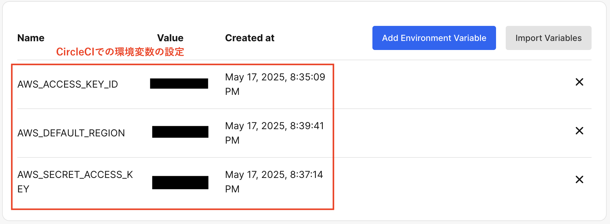
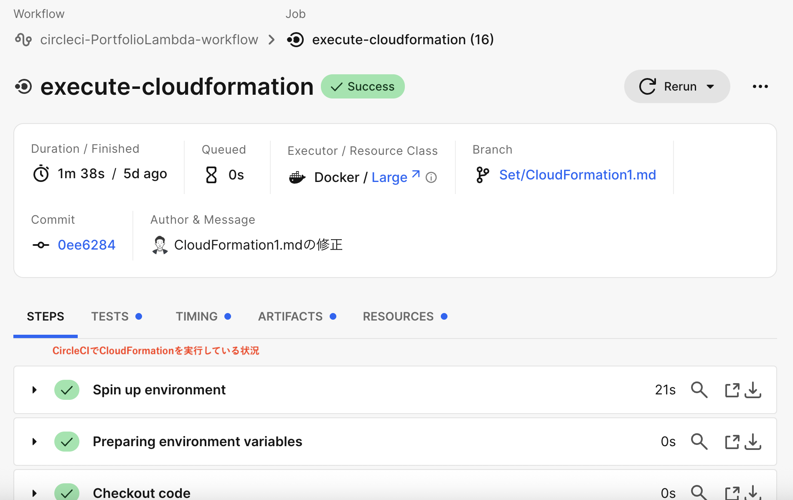
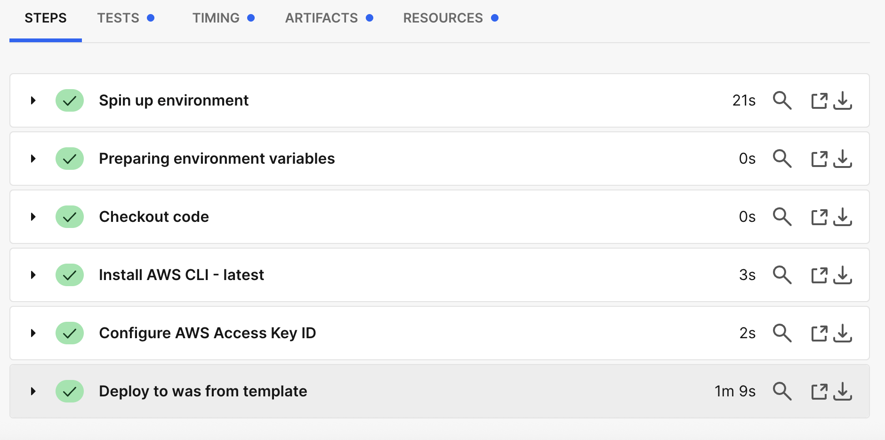
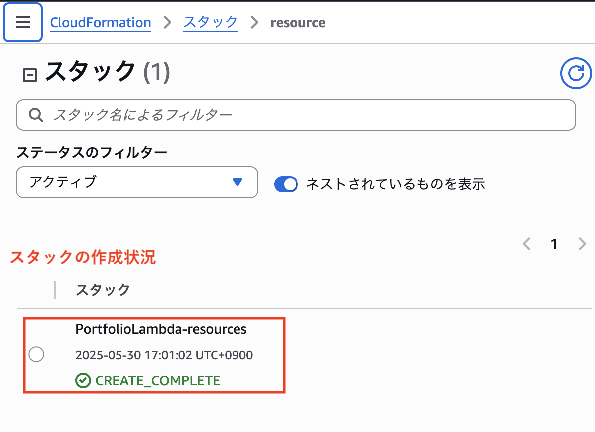
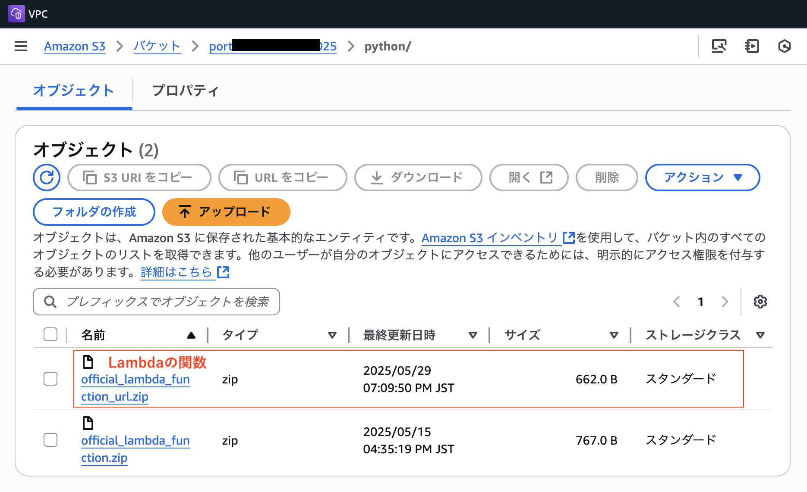
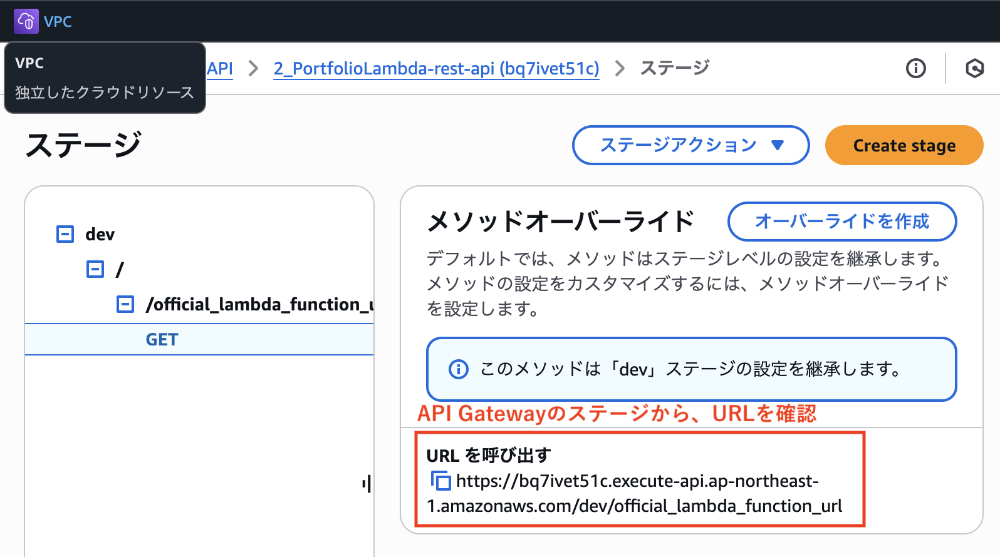
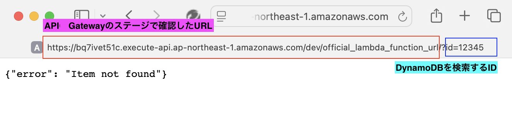
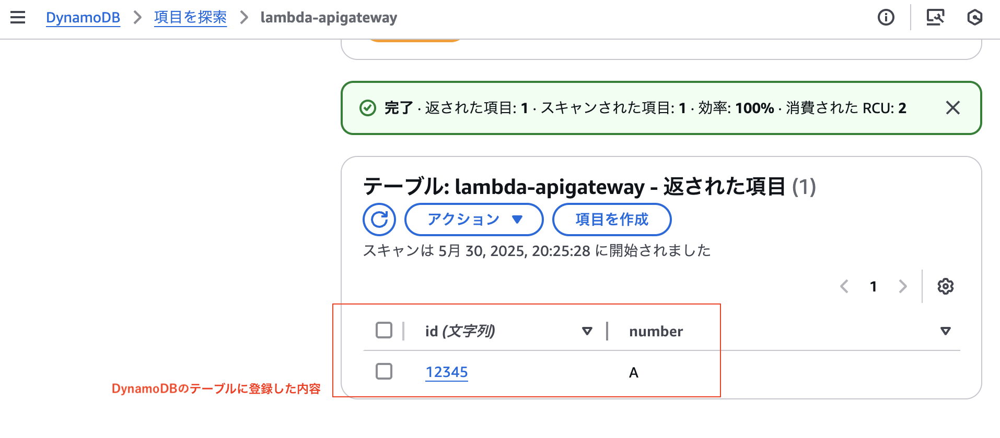
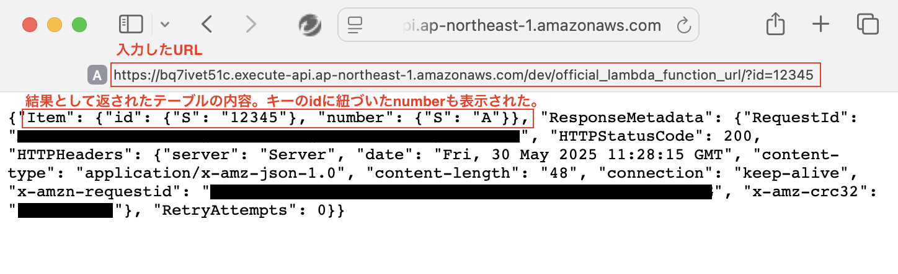

# CloudFormation1について

## 概要

* API Gateway（REST API）,Lambda,DynamoDBの連携した環境を、CircleCI,CloudFormationを使って自動構築する。本環境を構築することが目的であり、Lambda関数はAWS公式チュートリアル（https://docs.aws.amazon.com/ja_jp/lambda/latest/dg/services-apigateway-tutorial.html）のものを利用した。  
&emsp;同Lambda関数は、curlコマンドを利用して、DynamoDB テーブルの作成、読み取り、更新、および削除 (CRUD) 操作を実行します。なお同Lambda関数はS3に保管されているものとする。  
  

## 1. CircleCIに環境変数を設定  
&emsp;CircleCI上で、環境変数「AWS_ACCESS_KEY_ID」「AWS_DEFAULT_REGION」「AWS_SECRET_ACCESS_KEY」を設定した。
  

## 2. Cloudformationの実施結果  
&emsp;CircleCI上で、Cloudformationのテンプレートを自動実行し、「API Gateway」、「Lambda」、「DynamoDB」を作成した。
  

  

template  
 - [**resources.yml**](/CloudFormation/CloudFormation1/resources.yml)  

## 3.Lambdaの関数（python）をS3に保管  
&emsp;Lambdaは、既に作成してあるS3から関数を定義したファイルを参照するよう設定。
&emsp;関数は、CURLコマンドで、DynamoDB テーブルの作成(create)、読み取り(read)、更新()、および削除(delete) のCRUD操作を実行できる。
  

template  
 - [**official_lambda_function.py**](/LambdaFunction/python/official_lambda_function.py)

## 4.実施結果  
&emsp;クライアント端末から、CURLコマンドでPOST（作成）を実行して、DynamoDBにid(キー)とnumberを入力する。
  

   

&emsp;DynamoDBテーブルにidを登録した後、CURLコマンドでGET（読み取り）を実行し、DynamoDBのid（キー）を指定。
&emsp;結果として、numberの値が変えることを確認。  

  

  

## 5. 考察、その他参考
&emsp;今回はCURLコマンドを実行することで、API GatewayからLambda関数を呼び出し、DynamoDBのCRUD操作をするサービスを構築した。AWS公式チュートリアルにある同様のサービス内容をCloudFormationとCircleCIを使って環境構築を自動化し、Lambdaの関数はS3に保管するようにした。今後発展させ、さまざまなアプリとの連携を試みることで、パターンを増やしていきたい。
