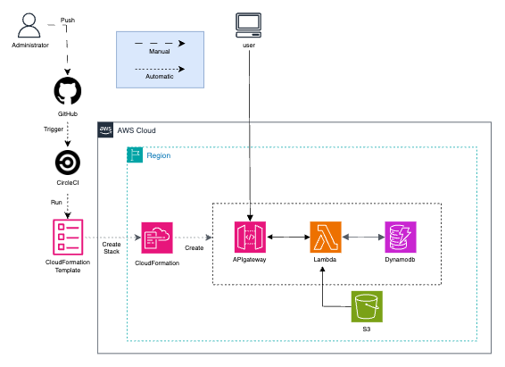
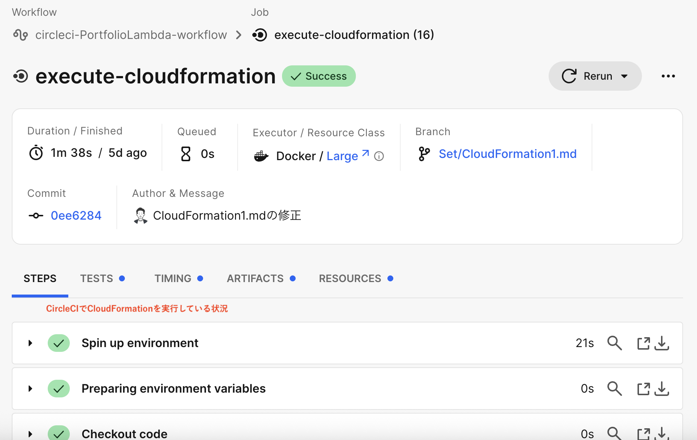
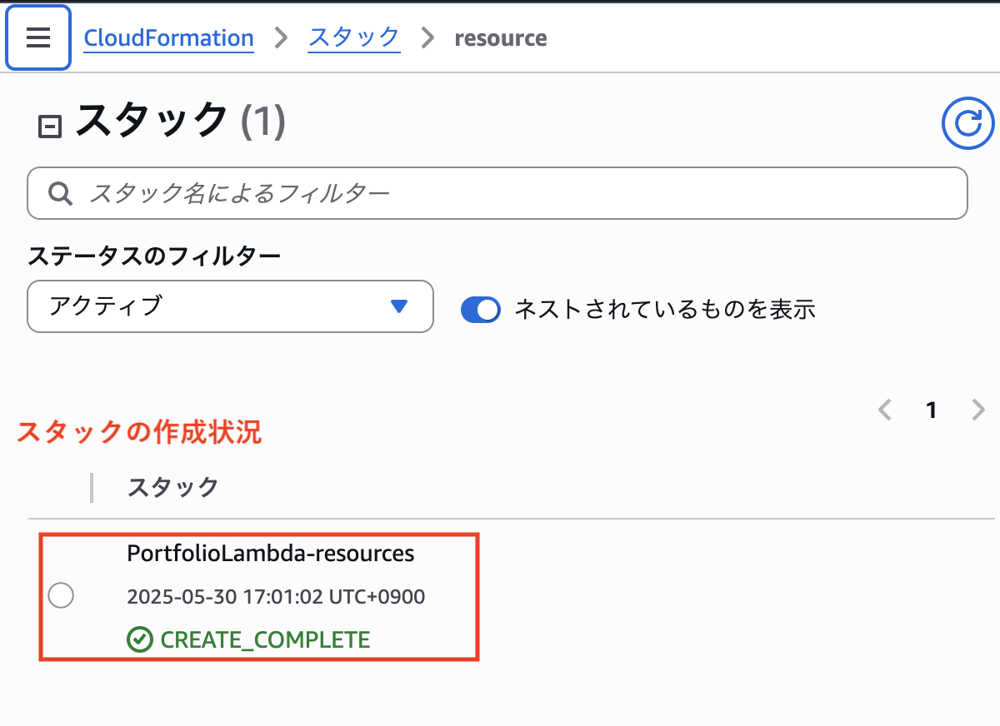
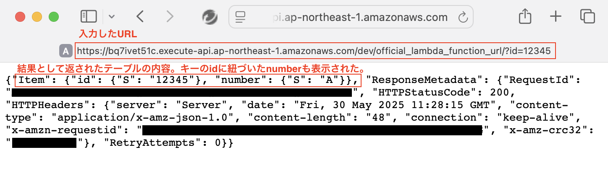

# CloudFormation2について

## 概要

* API Gateway（REST API）,Lambda,DynamoDBの連携した環境を、CircleCI,CloudFormationを使って自動構築する。本環境を構築することが目的であり、Lambda関数は簡易なものとし、ブラウザーのURL入力から、DynamoDBのテーブルの値を入手する処理を実行する。なお同Lambda関数はS3に保管されているものとする。  
  

## 1. CircleCIに環境変数を設定  
&emsp;CircleCI上で、環境変数「AWS_ACCESS_KEY_ID」「AWS_DEFAULT_REGION」「AWS_SECRET_ACCESS_KEY」を設定した。
  

## 2. Cloudformationの実施結果  
&emsp;CircleCI上で、Cloudformationのテンプレートを自動実行し、「API GAteway」、「Lambda」、「DynamoDB」を作成した。
  

  

template  
 - [**resources.yml**](/CloudFormation/CloudFormation2/resources.yml)  

## 3.Lambdaの関数（python）をS3に保管  
&emsp;Lambdaは、既に作成してあるS3から関数を定義したファイルを参照するよう設定。
&emsp;関数は、URLのGETメソッドで動作し、URLに入力されたidをDynamoDBから探しだし、表示する。なければ、「Item not found」を表示させる。
  

template  
 - [**official_lambda_function_url.py**](/LambdaFunction/python/official_lambda_function_url.py)

## 4.実施結果  
&emsp;ブラウザからURLで、 DynamoDBのidを検索する。
&emsp;一度目はidをDynamoDBに登録していないので、「Item not found」と結果が返る。
  

   

&emsp;DynamoDBテーブルにidを登録した後、ブラウザからURLで、 DynamoDBのidを検索する。
&emsp;検索したidと、これに紐づく値が結果として返る。  

  

  

## 5. 考察、その他参考
&emsp;今回はブラウザーからURL入力を判断してAPI GatewayがLambdaを起動、DynamoDBを操作するサービスを構築した。AWSによる環境構築がメインのため、現段階ではテーブルの読み取りしか行えない。また、REST API以外にHTTP APIがあるなど、サービスや連携させるアプリによって様々な構築の仕方を工夫する必要がある。
